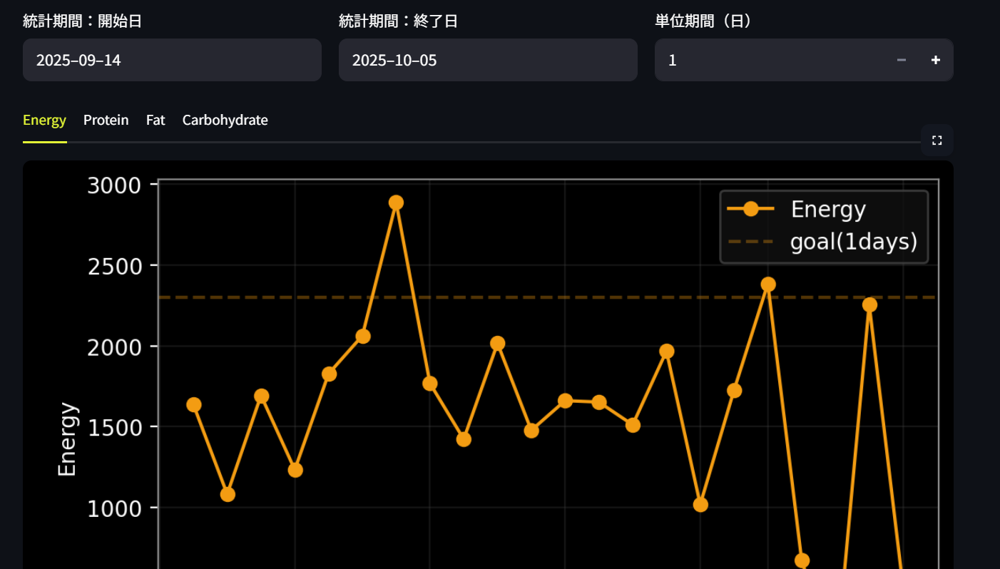

# portfolio-automation-tools
## Screenshots

*Note: Screenshots were taken before the UI was translated to English. The current published version runs in English and All code are provided in English.*

### Exercise Management


### Housework & Shopping & Household Management


### Network Management


### Nutrition Management


### Schedule Management


### Task Management


## Overview

* Purpose: A collection of small-scale automation apps designed to streamline personal academic, daily life, and research activities (calendar_sync / nutrition_tracker / contact_manager / exercise_dashboard).
* Approach: Minimal configuration with loosely coupled architecture, independent of shared modules (common/ currently unused).
* Target Audience: First-time users, interviewers, and future contributors.

## Features

* **Exercise_Management**: Exercise logging, METs estimation, weekly trend visualization
* **Housework&Shopping&Household_Management**: Housework notifications (mod/remainder method), task carryover management, shopping list display, expense visualization (statistics by category and payment method, monthly trends)
* **Network_Management**: Basic attributes with tagging, search functionality, birthday notifications, photo integration
* **Nutrition_Management**: Meal registration, nutrient estimation, weekly trend visualization
* **Schedule_Management**: Outlook synchronization, schedule candidate registration, task work time logging, recommended daily task processing time display
* **Task_Management**: Task inventory, daily task display

## Repository Structure

```
portfolio-automation-tools/
├── apps/
│   ├── Exercise_Management/
│   ├── Housework&Shopping&Household_Management/
│   ├── Network_Management/
│   ├── Nutrition_Management/
│   ├── Schedule_Management/
│   └── Task_Management/
├── docs/
│   ├── architecture.md
│   ├── ui_concept.pdf
│   └── screenshots/
├── LICENSE
└── README.md
```

## Requirements

* Python 3.11+
* Main libraries: streamlit, pandas, matplotlib, etc. (refer to requirements.txt in each app)
* OS: Windows 11

## Quick Start

**Python: 3.11 recommended (3.10–3.12 compatible)**

### 1. Clone the repository

```bash
git clone https://github.com/you/portfolio-automation-tools.git
cd portfolio-automation-tools
```

### 2. Create and activate virtual environment

**macOS/Linux:**

```bash
python -m venv .venv
source .venv/bin/activate
```

**Windows (PowerShell):**

```powershell
python -m venv .venv
.venv\Scripts\Activate.ps1
```

### 3. Install dependencies (example: Nutrition Management)

```bash
cd apps/Nutrition_Management
pip install -r requirements.txt
```

### 4. Launch (change port value if conflicts occur)

```bash
streamlit run app.py --server.port 8501
```

**Note: To specify port via environment variable**

**macOS/Linux:**

```bash
export STREAMLIT_SERVER_PORT=8501
```

**Windows (PowerShell):**

```powershell
$Env:STREAMLIT_SERVER_PORT=8501
```

## Configuration

* Each app in this repository works with default settings. No environment variable configuration required.
* Databases use relative paths within the app (e.g., tasks.db).
* No sensitive information is included.

## License

* MIT

